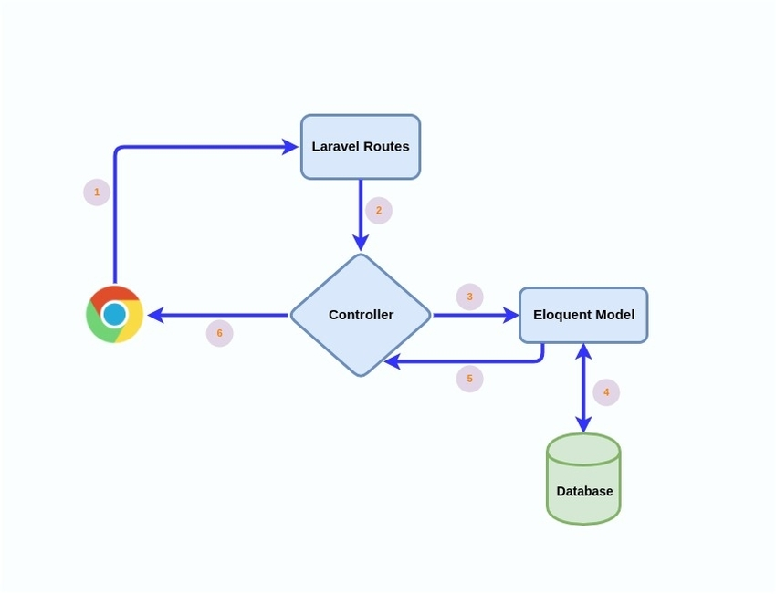

# Laravel Grafite

This is a pre-packaged [Laravel](https://laravel.com/) 5.6.* project which uses [Grafite CMS](https://github.com/GrafiteInc/CMS)

### What does this project include? ###

* [Laravel Framework 5.6.*](https://laravel.com/)
* [Grafite CMS](https://github.com/GrafiteInc/CMS)
* [Grafite Builder for CRUD Scaffolding](https://github.com/GrafiteInc/Builder) 
* [GraphQL](https://github.com/Folkloreatelier/laravel-graphql)
* [Datatables](https://github.com/yajra/laravel-datatables)


## Requirements

- [Node](https://nodejs.org) 4.* or better
- PHP 7.1.3 or better


## Installation

Start by installing dependencies:

```sh
composer install
```


```sh
npm install
```


Publish the assets:

```sh
php artisan vendor:publish
```

Generate an app key:

```sh
php artisan key:generate
```

Create a symbolic link from the public disk directory (this is required for images stored in public):
```sh 
php artisan storage:link
```


## Database
Configure a database:
Open the ```.env``` file in the root of the project and configure a database connection.
If the ```.env``` file does not exist then clone the ```.env.example``` file and rename it to ```.env```.

Run migrations:
```sh
php artisan migrate
```

Seed the database:
```sh
php artisan db:seed
```

Set up Laravel Passport for api authentication:
```sh
php artisan passport:install
```

There should be a default admin account for you with the following credentials:

* **Username**: admin@example.org or admin@example.com
* **Password**: admin


## Running

Once dependencies are installed, run with:

```sh
php artisan serve
```
This will open up a Laravel development server at localhost:8000


## Admin Access
Login to Admin Panel by visiting: www.yoursite.com/admin


## CRUD Builder
To use the CRUD builder you need to run the following command:
```sh
php artisan crudmaker:new Post --api --ui=bootstrap --migration --schema="id:increments,name:string,author:string" --relationships="belongsToMany|\App\Models\Tag|tags"
```
You can use the following options for the above command:
```sh
php artisan crudmaker:new ModelName
{--api} # if you want to generate REST api routes, controllers and middleware
{--ui=bootstrap|semantic} # css style
{--serviceOnly} # if you only want service classes generated
{--withFacade} # fuck knows
{--withoutViews}  # don't generate view files
{--migration} # generate a migration script
{--schema} # specify the schema data i.e. db columns
{--relationships} # generate relationships
```
You can view the full documentation for this [here](https://laracogs.com/docs/services/crud/)  


## Using GraphQL

Use [this article](http://www.qcode.in/build-api-for-twitter-like-app-using-graphql-in-laravel/) as a guide for setting up and using GraphQL as an API service

## Cache

Laravel configuration and app settings are cached in memory by default. You would near to clear the cache if you have made changes to the config files, expecially the ```.env``` file. To clear the cache you can run the following commands:

**Clear config cache:** 
```php artisan config:clear```

**Clear general cache:** 
```php artisan cache:clear```

**Clear config cache and generate new cache file:**
``` php artisan config:cache ```

## Running Tests

**Run all tests:**
```sh
.\vendor\bin\phpunit
```

**Run all tests from one class**
```sh
.\vendor\bin\phpunit --filter MyTestClass
```

**Run single test method**
```sh
.\vendor\bin\phpunit tests/Feature/{testfilename} 

.\vendor\bin\phpunit tests/Unit/{testfilename} 
```

## Laravel Architecture




### Contribution guidelines ###

* Writing tests
* Code review
* Other guidelines

### Who do I talk to? ###

* Repo owner or admin
* Other community or team contact